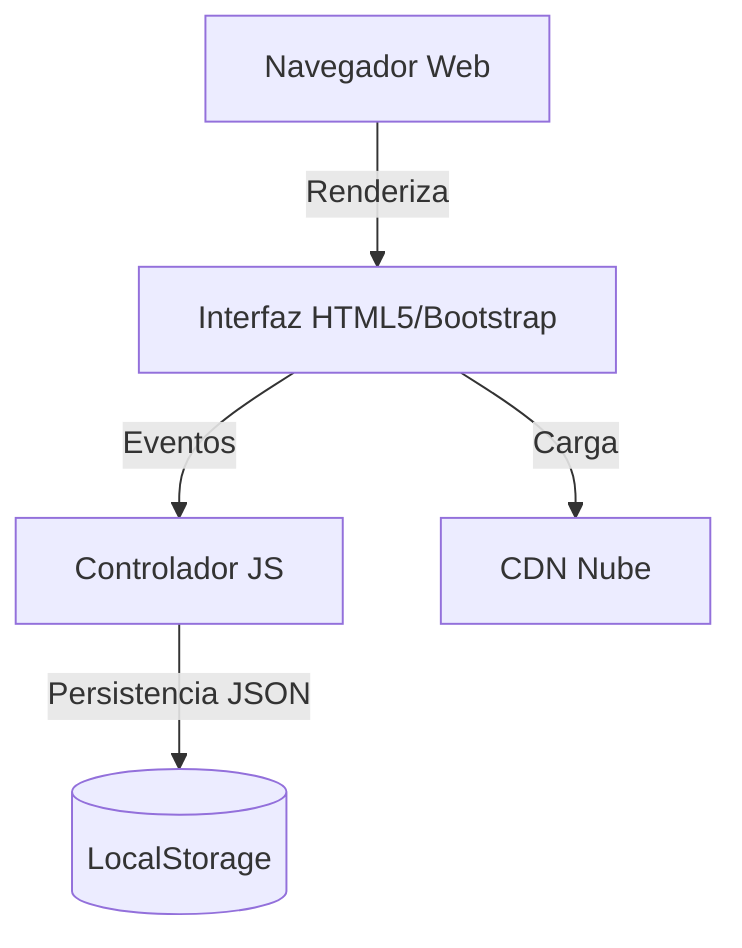

# Documentación Maestra del Proyecto: Portal de Investigación ESCAR

**Versión:** 3.0
**Fecha de Publicación:** 05 de Enero de 2026
**Cliente:** Escuela Nacional de Carabineros "Alfonso López Pumarejo" (ESCAR)
**Clasificación:** Confidencial / Uso Interno y Público

---

## 1. Introducción

### 1.1 Propósito
El presente documento tiene como objetivo definir de manera exhaustiva la arquitectura, funcionalidad, operación y mantenimiento del **Portal de Investigación ESCAR**. Este portal sirve como el punto central de acceso a la información científica, tecnológica y de innovación de la Escuela.

### 1.2 Alcance
El proyecto abarca el diseño, desarrollo e implementación de un portal web tipo *Frontend-Only* (sin backend activo en fase 1) que permite:
*   Visualización pública de grupos de investigación, semilleros y perfiles académicos.
*   Gestión básica (CRUD) de investigadores mediante almacenamiento local persistente.
*   Presentación de estadísticas de impacto en tiempo real.
*   Integración con identidad visual institucional ("Police Blue").

### 1.3 Audiencia
*   **Desarrolladores**: Para mantenimiento y futuras iteraciones.
*   **Administradores**: Para la gestión de contenido.
*   **Stakeholders**: Para la validación de cumplimiento de requisitos y costos.

---

## 2. Arquitectura del Sistema

### 2.1 Diagrama de Componentes
El sistema opera bajo un modelo de cliente pesado (Thick Client) donde la lógica reside en el navegador del usuario.



### 2.2 Stack Tecnológico
| Capa | Tecnología | Versión | Justificación |
| :--- | :--- | :--- | :--- |
| **Estructura** | HTML5 | Semántica | Estándar web, accesibilidad (ARIA). |
| **Estilos** | CSS3 / Bootstrap | 5.3.2 | Rapidez de maquetado, Grid System robusto. |
| **Lógica** | JavaScript (ES6+) | Vanilla | Sin frameworks pesados para maximizar portabilidad. |
| **Datos** | LocalStorage API | N/A | Persistencia sin servidor para demo/MVP. |
| **Assets** | Cloud (Unsplash/Pexels) | N/A | Optimización de ancho de banda y portabilidad. |

### 2.3 Estructura de Directorios
```text
/Investigacion_Escar/
├── Index.html                # Landing Page (Dashboard)
├── Investigadores.html       # Módulo de Gestión de Talento
├── Grupos-Inovacion.html     # Catálogo de Grupos
├── Semilleros.html           # Información Académica
├── CSS/
│   └── Styles.css            # Hoja de estilos monolítica (Tema Policía)
└── JS/
    ├── Script.js             # Lógica Core (Observadores, Animaciones)
    ├── investigadores.js     # Controlador de Entidad Investigador
    └── grupos.js             # Controlador de Entidad Grupo
```

---

## 3. Esquema de Base de Datos (Modelo de Datos)

Aunque el sistema es *Serverless* en esta fase, utiliza un esquema relacional estricto almacenado como cadenas JSON en el `LocalStorage` del navegador.

### 3.1 Entidad: Investigadores (`investigadores`)
Almacena la información del personal académico.

| Campo | Tipo | Restricción | Descripción |
| :--- | :--- | :--- | :--- |
| `id` | Integer | PK, Auto-inc | Identificador único. |
| `nombre` | String | Not Null | Nombre completo del investigador. |
| `correo` | String | Email Format | Correo institucional. |
| `area` | String | Enum | Área de conocimiento (Tecnología, Ciencias, etc.). |
| `foto` | String | URL | Enlace a la fotografía de perfil. |

### 3.2 Entidad: Grupos (`grupos`)
Catálogo de grupos de investigación avalados.

| Campo | Tipo | Restricción | Descripción |
| :--- | :--- | :--- | :--- |
| `id` | Integer | PK | Identificador del grupo. |
| `nombre` | String | Not Null | Nombre oficial del grupo. |
| `categoria` | String | A, B, C | Clasificación MinCiencias. |

---

## 4. Documentación API (Funciones Core)

Esta sección documenta las funciones JavaScript críticas que actúan como la "API Interna" del sistema.

### 4.1 Módulo de Estadísticas (`Script.js`)

#### `updateStatistics()`
Sincroniza los contadores del Dashboard con la base de datos local.
*   **Entrada**: Ninguna.
*   **Proceso**: Lee `localStorage`, cuenta registros por entidad.
*   **Salida**: Ejecuta `animateValue()` para cada contador.

#### `animateValue(id, start, end, duration)`
Genera una animación numérica progresiva.
*   **Parámetros**:
    *   `id` (string): ID del elemento DOM.
    *   `start` (int): Valor inicial (0).
    *   `end` (int): Valor final (count).
    *   `duration` (int): Tiempo en ms (2000).

### 4.2 Módulo de Investigadores (`investigadores.js`)

#### `cargarInvestigadores(filtro = "")`
Renderiza la grilla de tarjetas de investigadores.
*   **Parámetros**: `filtro` (string, opcional) - Texto para búsqueda fuzzy.
*   **Retorno**: `void` (Modifica el DOM directamente).

#### `guardarInvestigador(data)`
Crea un nuevo registro en el almacenamiento.
*   **Parámetros**: `data` (Object) - Objeto con esquema de Investigador.
*   **Validaciones**: Verifica que el correo sea único.

---

## 5. Guía de Instalación y Uso

### 5.1 Requisitos Previos
*   Navegador Web Moderno (Chrome 90+, Firefox 88+, Edge).
*   Conexión a Internet (para carga de recursos CDN).

### 5.2 Instalación Local
1.  **Clonar/Descargar**: Obtenga la carpeta del proyecto.
2.  **Despliegue**: No requiere servidor (Apache/Nginx). Simplemente haga doble clic en `Index.html`.
3.  **Verificación**: Asegúrese de ver el video de fondo y los logos cargando.

### 5.3 Implementación en Servidor
1.  Suba todos los archivos (`.html`, `/CSS`, `/JS`) a la raíz pública (`public_html` o `/var/www/html`).
2.  Verifique permisos de lectura (644 para archivos, 755 para carpetas).

---

## 6. Planes de Prueba y QA

### 6.1 Estrategia de Pruebas
Se utiliza una estrategia de pruebas manuales de caja negra centradas en la funcionalidad y la interfaz de usuario.

### 6.2 Matriz de Casos de Prueba (Extracto)

| ID | Módulo | Escenario | Pasos | Resultado Esperado |
| :--- | :--- | :--- | :--- | :--- |
| **TC-01** | Inicio | Carga de Assets | 1. Limpiar caché.<br>2. Cargar Index. | El video de fondo debe reproducirse automáticamente. |
| **TC-02** | CRUD | Crear Investigador | 1. Ir a Investigadores.<br>2. Llenar form.<br>3. Guardar. | Alerta "Guardado con éxito" y aparición en grilla. |
| **TC-03** | UI | Scroll | 1. Bajar scroll 200px. | Las secciones deben aparecer con efecto `fade-in`. |
| **TC-04** | UI | Back to Top | 1. Bajar al footer.<br>2. Click botón flecha. | Scroll suave hasta el header (0px). |

---

## 7. Presupuesto y Costos (Mercado Colombia)

Análisis financiero detallado para la construcción de este sistema, basado en tarifas profesionales promedio (Agencia/Freelance Senior) en Colombia para 2025/2026.

**Tarifa Referencia**: $35 USD/hora (~$140,000 COP/hora).

| Fase | Actividad | Horas | Subtotal (COP) |
| :--- | :--- | :---: | :---: |
| **1. Arquitectura** | Diseño de solución, diagramas UML, selección de stack. | 12 | $1,680,000 |
| **2. UI/UX** | Prototipado alta fidelidad, diseño de componentes "Police Theme". | 20 | $2,800,000 |
| **3. Frontend Dev** | Maquetación HTML/CSS, Lógica JS, Integración APIs locales. | 60 | $8,400,000 |
| **4. QA & Testing** | Pruebas funcionales, fixes, pruebas de compatibilidad móvil. | 15 | $2,100,000 |
| **5. Documentación** | Manuales técnicos, de usuario y entrega final. | 8 | $1,120,000 |
| **TOTAL** | | **115h** | **$16,100,000 COP** |

*Nota: Estos costos no incluyen IVA ni soporte mensual post-entrega.*

---

## 8. Cierre y Soporte

### 8.1 Registro de Cambios (Changelog)

*   **v1.0 (11-Oct-2025)**: Lanzamiento inicial (Alpha).
*   **v2.0 (17-Oct-2025)**: Integración de estilos institucionales y lógica JS.
*   **v3.0 (05-Ene-2026)**: Migración Cloud, Empaquetado Portable y Mejoras UX (Scroll/TopBtn).
    *   *Autor*: Equipo de Desarrollo Semillero Manos Verdes.

### 8.2 Soporte
Para reportar fallos o solicitar nuevas funcionalidades, contactar al Departamento de Telemática de la Dirección de Escuelas.

---
*Fin del documento.*
